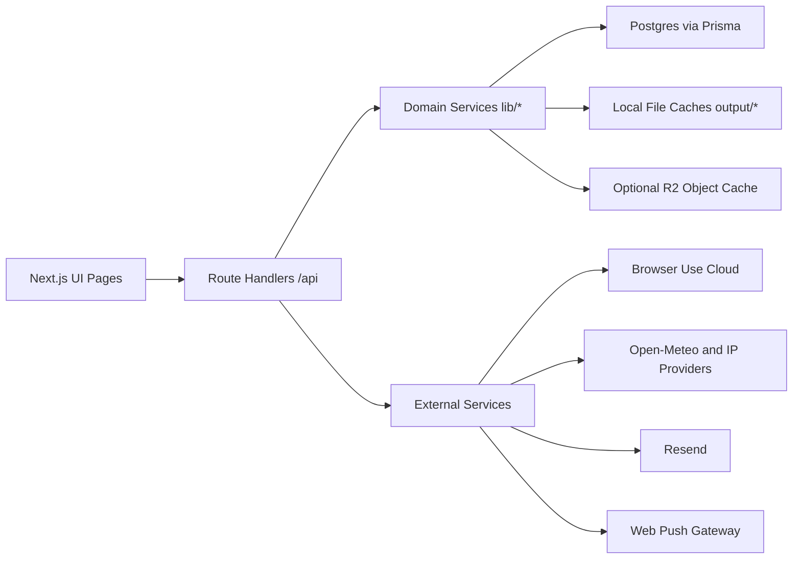
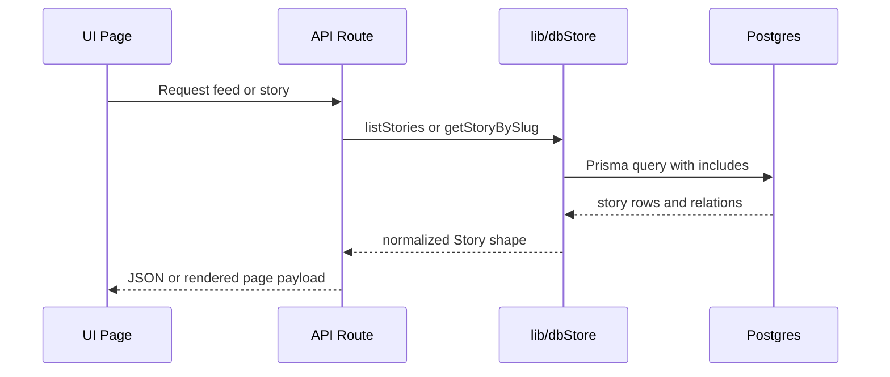
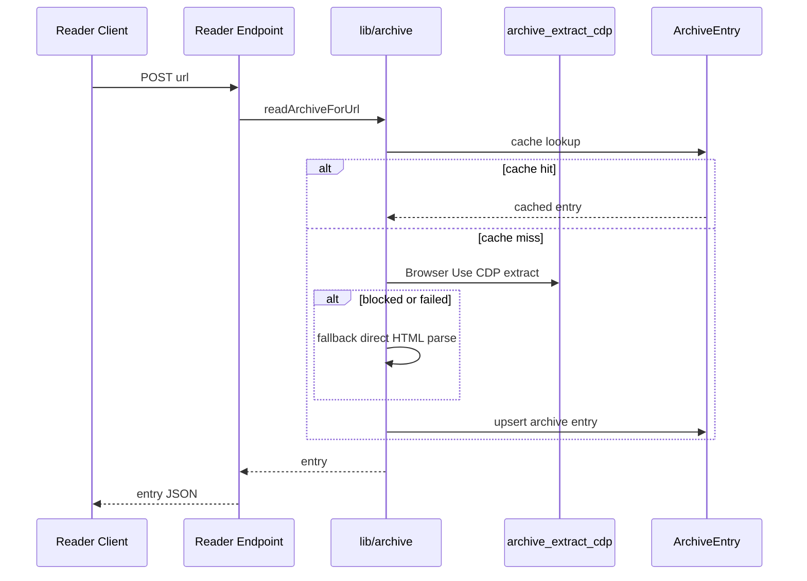

# Architecture

## 1. System Overview

OpenGroundNews is a Next.js App Router application backed by PostgreSQL via Prisma.

It combines:
- Server-rendered and client-enhanced news UI surfaces
- A DB-backed store layer for feeds/search/story detail
- Browser Use + Playwright ingestion and archive retrieval pipelines
- User personalization, newsletter, and push infrastructure

## 2. Runtime Topology

### Primary runtime packages
- UI shell and routes: `app/`, `components/`
- API handlers: `app/api/`
- Domain/data services: `lib/`
- Persistence schema: `prisma/schema.prisma`
- Offline/ops pipelines: `scripts/`

## 3. Core Runtime Layers

### 3.1 Web and UI layer
- Root layout and theme boot: `app/layout.tsx`
- Global styles and tokens: `app/globals.css`, `app/styles/tokens.css`
- Major product surfaces:
  - Home feed (`/`)
  - Story detail (`/story/[slug]`)
  - Topic/source hubs (`/interest/[slug]`, `/source/[slug]`)
  - Compare/calendar/maps (`/compare`, `/calendar`, `/maps`)
  - Reader (`/reader`)
  - Personalization area (`/my/*`, `/my-news-bias`)
  - Admin (`/admin`)

### 3.2 API layer
- Route handlers under `app/api/**/route.ts`
- Two endpoint families:
  - Product APIs: `/api/*`
  - Legacy/parity APIs: `/api/v1/*`

### 3.3 Domain/data layer
- Prisma client bootstrap and runtime-safe lazy behavior: `lib/db.ts`
- Store façade: `lib/store.ts` (re-exporting DB-backed `lib/dbStore.ts`)
- Search engine: `lib/search.ts`
- Archive retrieval and fallback: `lib/archive.ts`
- Media proxy and object storage: `lib/media/*`
- Auth/session/prefs: `lib/dbAuth.ts`, `lib/authOptions.ts`, `lib/authCookies.ts`

## 4. Persistence Model

Defined in `prisma/schema.prisma`.

### 4.1 Content graph
- `Story`
- `SourceArticle`
- `Outlet`
- `StoryTag`
- `StorySnapshot`
- `StoryTimelineEvent`
- `StoryPodcastReference`
- `StoryReaderLink`
- `StoryRelatedStory`
- `StoryGeo`

### 4.2 User and auth
- `User`
- `Session`
- `OAuthAccount`
- `PasswordResetToken`
- `UserPrefs`
- `Follow`
- `SavedStory`
- `ReadingEvent`
- `CustomFeed`
- `Feedback`

### 4.3 Operations and messaging
- `ArchiveEntry`
- `IngestionRun`
- `PushSubscription`
- `NewsletterSignup`
- `DigestJob`
- `DigestDelivery`
- `ApiRateLimitCounter`

### 4.4 Outlet intelligence
- `OutletOwnershipEntity`
- `OutletOwnershipEdge`

## 5. Request and Data Flows

### 5.1 Feed and story retrieval

Key behaviors:
- `listStories` supports topic/view/edition/location filtering
- In-memory store cache (`OGN_STORE_CACHE_TTL_MS`, default ~45s)
- Story dedupe by canonical URL/title/topic heuristics
- Story detail includes timeline, snapshots, podcasts, reader links, related stories, geo

### 5.2 Reader and archive retrieval

Key behaviors:
- URL safety validation blocks private/local/credentialed URLs
- Circuit breaker (`archive-read`) opens after repeated failures, cools down after 60s
- Fallback extraction uses direct fetch + `cheerio`

## 6. Ingestion Architecture

Pipeline entrypoint chain:
- `scripts/ingest_groundnews.mjs`
- `scripts/pipeline/index.mjs` (retry + checkpoint wrapper)
- `scripts/sync_groundnews_pipeline.mjs` (core orchestration)

### 6.1 Pipeline stages
1. Load script env (`scripts/lib/load_env.mjs`)
2. Parse CLI flags + env tuning
3. Run route discovery/scrape (`scripts/groundnews_scrape_cdp.mjs`)
4. Expand routes (optional)
5. Enrich stories via CDP sessions
6. Optional outlet enrichment
7. Placeholder image repair and cache normalization
8. Persist to DB (`scripts/lib/gn/persist_db.mjs`)
9. Persist ingestion telemetry (`IngestionRun`)

### 6.2 Reliability mechanisms
- Retry wrapper with attempt backoff
- Checkpoint writes (`output/browser_use/groundnews_cdp/checkpoint.json`)
- Browser session rotation strategies (profile/proxy pools)
- Recovery script for stale sessions: `browseruse:stop-active-browsers`

## 7. Auth and Authorization Model

OpenGroundNews uses a hybrid model:
- Custom cookie sessions (`ogn_session`) stored in `Session`
- NextAuth JWT sessions for OAuth state
- OAuth sync endpoint bridges NextAuth session into `ogn_session`

Auth modules:
- `lib/dbAuth.ts` (session/password/reset/admin role logic)
- `lib/authOptions.ts` (NextAuth provider callbacks)
- `lib/authCookies.ts` (cookie options)

Important behavior:
- `/api/auth/signup` is intentionally disabled (`410`)
- Google OAuth is enabled only when keys are configured
- First user or allowlisted emails can become admin

## 8. Security and Guardrails

- API key gate (`x-ogn-api-key` or Bearer) for sensitive automation endpoints
- URL SSRF protection via `validateExternalUrl`
- Same-origin enforcement for OAuth sync route
- Sanitized server errors (`sanitizeServerErrorMessage`) to avoid path leakage
- Session cookies are `HttpOnly`, `SameSite=Lax`, secure in production

## 9. Caching Strategy

### 9.1 App data
- In-process story cache in `lib/dbStore.ts` (short TTL)

### 9.2 Archive cache
- Durable DB cache in `ArchiveEntry`

### 9.3 Image cache
- Local file cache: `output/cache/images`
- Optional Cloudflare R2 backing store
- SVG fail-open fallback for unavailable sources

### 9.4 Rate limiting
- `lib/infra/rateLimit.ts`
- Uses Upstash Redis when available, falls back to in-memory counters

## 10. Notifications and Messaging

### Newsletter
- Signup API stores `NewsletterSignup`
- Digest endpoint uses `Resend`

### Web Push
- Subscription endpoints upsert/delete `PushSubscription`
- Delivery via `lib/push.ts` with VAPID keys
- Daily push route fans out to users with `notifyDailyBriefing=true`

## 11. Browser Extension Surface

The MV3 extension in `extension/`:
- opens current tab in `/reader?url=...`
- opens `/search?q=...` for the active page
- supports configurable base app URL in options

It does not use privileged backend APIs directly.

## 12. Operational Interfaces

- Admin page (`/admin`) reads dashboard stats from store/DB
- Admin ingest trigger calls `/api/ingest/groundnews` with API key + admin session
- `IngestionRun` rows provide run history and quick diagnostics

For runbooks and scheduler guidance, see `OPERATIONS.md`.
